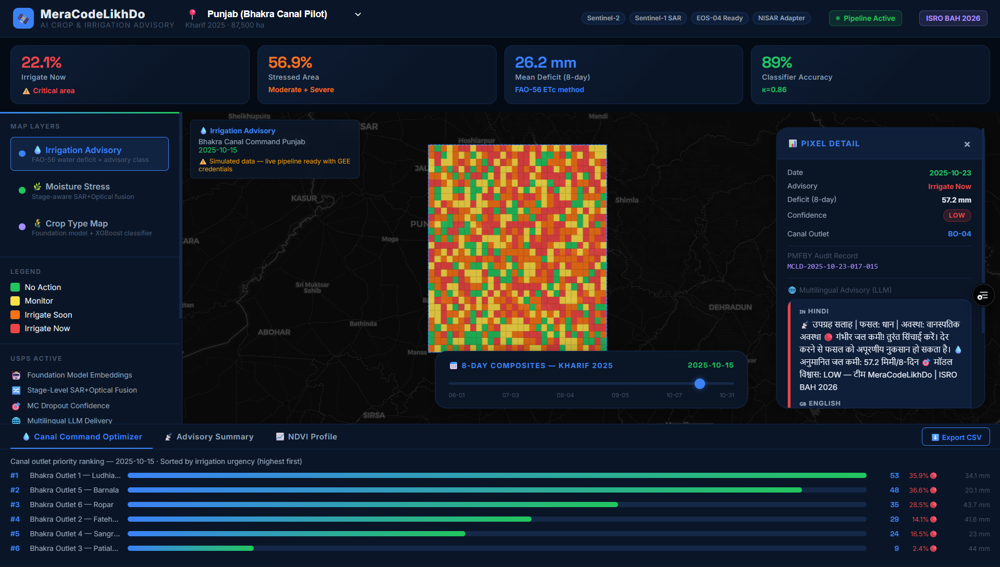

# 🛰️ MeraCodeLikhDo — AI-Driven Crop Monitoring & Irrigation Advisory System

> **ISRO BAH 2026 Hackathon Submission**  
> **Team:** MeraCodeLikhDo | Gaurav Tiwari (Lead), Shubham Singh, Prajjwal Singh, Krishna Gupta



---

## 🌾 What This Does

A satellite-driven, AI-powered precision agriculture platform that:

1. **Identifies crop types** from multi-temporal Sentinel-2/Landsat/MODIS imagery using foundation-model embeddings + Random Forest/XGBoost
2. **Detects moisture stress** across growth stages (sowing → vegetative → flowering → maturity) using phenology-aware fusion of optical (NDVI/VCI) and SAR (VV/VH) indices
3. **Generates 8-day irrigation advisories** (No Action / Monitor / Irrigate Soon / Irrigate Now) with confidence flags, powered by FAO-56 crop-coefficient water-deficit estimation
4. **Delivers multilingual field alerts** via LLM-generated Hindi/English SMS & WhatsApp messages
5. **Optimizes canal command scheduling** by aggregating pixel-level demand to outlet-level water-release priorities

---

## 🏆 Unique Selling Points (USPs)

| USP | Description |
|-----|-------------|
| 🤖 Foundation Model Embeddings | Prithvi-EO-2.0 / Clay for few-shot crop classification |
| 🔀 True Stage-Level SAR+Optical Fusion | Not just gap-filling — fused at each phenological stage |
| 🎯 Confidence-Aware Advisory | Monte Carlo Dropout uncertainty flags per advisory cell |
| 🌐 Multilingual LLM Delivery | Hindi/English advisory via LLM NLG layer |
| 💧 Canal Command Optimizer | Pixel demand → outlet-level water-release prioritization |
| 🛰️ NISAR-Ready SAR Adapter | Swappable ingestion module ready for NISAR data |
| 📋 PMFBY Auditability | Timestamped immutable advisory trail for insurance claims |
| 🆓 Zero License Cost | 100% open/free-tier stack — scalable nationally |

---

## 🗂️ Project Structure

```
ISRO BAH/
├── backend/              # FastAPI + ML pipeline
│   ├── app/
│   │   ├── main.py
│   │   ├── api/          # REST endpoints
│   │   ├── core/         # config, settings
│   │   ├── models/       # ML models
│   │   ├── pipeline/     # GEE ingestion, processing
│   │   └── services/     # advisory, LLM, canal optimizer
│   ├── data/             # Sample/demo GeoJSON outputs
│   ├── requirements.txt
│   └── Dockerfile
├── frontend/             # Next.js 14 + Mapbox GL JS dashboard
│   ├── src/
│   │   ├── app/
│   │   ├── components/
│   │   └── lib/
│   └── package.json
├── notebooks/            # Jupyter research notebooks
│   ├── 01_data_ingestion.ipynb
│   ├── 02_feature_engineering.ipynb
│   ├── 03_crop_classification.ipynb
│   ├── 04_stress_detection.ipynb
│   └── 05_water_deficit_advisory.ipynb
├── data/                 # AOI GeoJSON, sample data
├── docker-compose.yml
└── README.md
```

---

## 🚀 Quick Start

### Prerequisites
- Docker & Docker Compose
- Node.js 18+
- Python 3.11+

### 1. Clone & Start Backend
```bash
cd backend
pip install -r requirements.txt
uvicorn app.main:app --reload --port 8000
```

### 2. Start Frontend
```bash
cd frontend
npm install
npm run dev
# Open http://localhost:3000
```

### 3. Docker Compose (all services)
```bash
docker-compose up --build
```

---

## 🛰️ Data Sources

| Type | Source | Access |
|------|--------|--------|
| Optical | Sentinel-2 L2A, Landsat-8/9, MODIS MOD13Q1 | Google Earth Engine (free) |
| SAR | Sentinel-1 GRD, ISRO EOS-04 | Copernicus Hub / Bhoonidhi |
| Met | IMD rainfall, ERA5/CHIRPS ET | Open APIs |
| Ancillary | FAO Kc tables, Canal GIS, Soil maps | FAO / Open data |

---

## 🧠 Technology Stack

| Layer | Technology |
|-------|-----------|
| Frontend | Next.js 14, React, Mapbox GL JS, Tailwind CSS |
| Backend | FastAPI, Python 3.11 |
| Geospatial | earthengine-api, rasterio, geopandas, xarray |
| ML | scikit-learn, XGBoost, LightGBM, PyTorch, SHAP |
| Foundation Models | Prithvi-EO-2.0, Clay Foundation Model |
| Advisory NLG | Google Gemini / OpenAI |
| Database | PostgreSQL + PostGIS |
| DevOps | Docker, Docker Compose |

---

## 👥 Team MeraCodeLikhDo

| Member | Role |
|--------|------|
| Gaurav Tiwari | Team Lead — Architecture & Pipeline Integration |
| Shubham Singh | Satellite Data Engineering — Optical/SAR Ingestion |
| Prajjwal Singh | AI/ML — Crop Classification, Stress Detection, Water Deficit |
| Krishna Gupta | Full-Stack — Dashboard, API, Multilingual Delivery |

---

*Built on open ISRO (Bhuvan / Bhoonidhi), ESA and NASA satellite data • ISRO BAH 2026*
